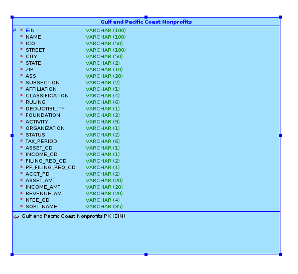

Data Science Fall 2014 R Project
===
**This project analyzes the Nonprofit Organizations data from the ggplot2 package which has been supplemented with additional synthetic data and stored in an Oracle database.**

###This is how my RStudio is configured:
```{r}
sessionInfo()
```

###These are the packages I load from .Rprofile:
```{r}
# To get this to work in your environment, change the following directory/folder path to the path to your project files.
setwd("/home/jbur/w/School/DV/RProject")
system("cat .Rprofile", intern = TRUE)
```

###Nonprofs Data Model

  

###Nonprofs Data 

####Nonprofs.ddl 

```{r}
# To get this to work in your environment, change the following directory/folder path to the path to your project files.
setwd("/home/jbur/w/School/DV/RProject/02NonprofsData")
system("cat Nonprofs.ddl", intern = TRUE)
``` 

```{r}
source("../03Analysis/JoshAnal.R", echo = TRUE)
```


